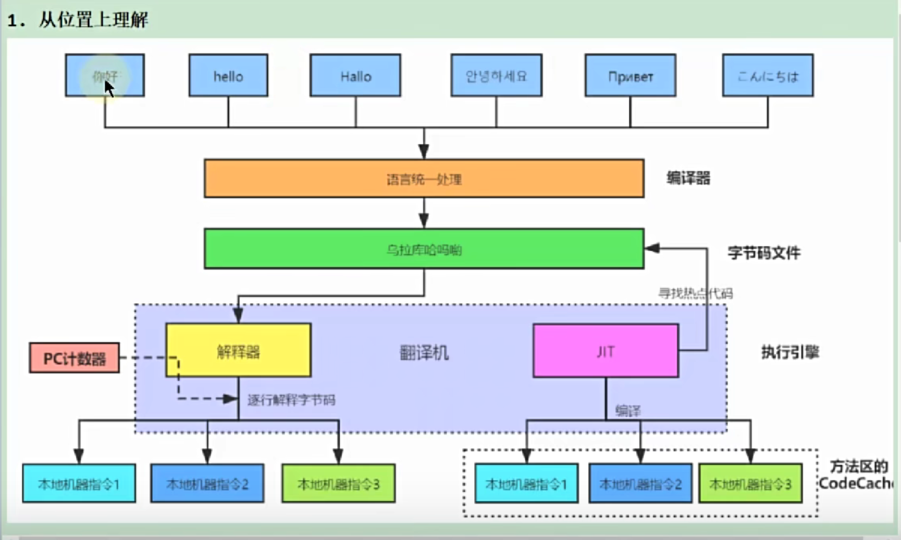
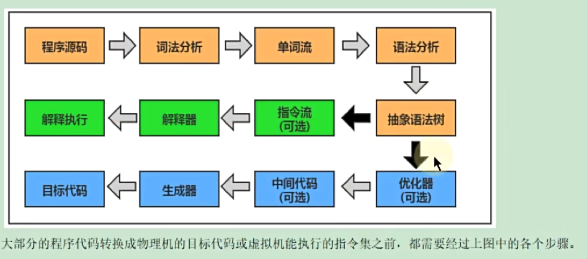

## 字节码文件概述

### 字节码编译器
在编译为class文件时，依然存在编译环节，半编译半解释。  
编译器分未前端编译器和后端编译器。  
常见的javac就是前端编译器，将.java文件编译为.class文件。

不同颜色代笔前端编译器，后端编译器，解释器。

### 哪些类有字节码文件
- class(类文件、匿名内部类、外部类等)
- 接口
- 枚举
- 注解
- 基本数据类型
- 数组
- void