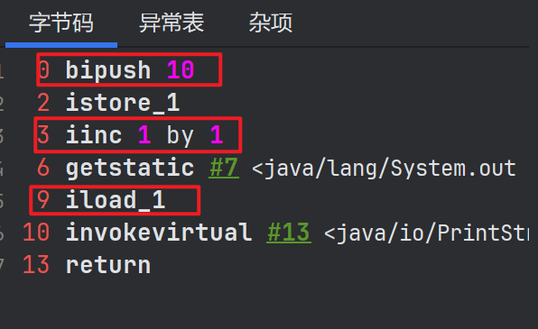
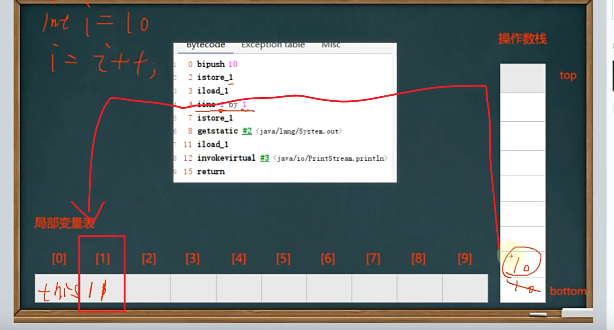
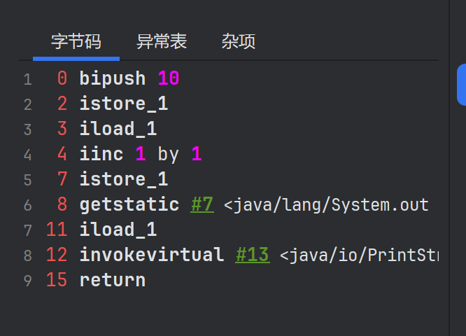

## 字节码指令
java虚拟机的指令由**一个字节**长度的，代表着某种特定操作含义的数字(称为**操作码**，Opcode)  
以及跟随其后的零至多个代表此操作所需的参数(称为**操作数**，Operand)构成。  

操作码加操作数就构成字节码指令。

### i++ 和 ++i
局部变量表和操作数栈， 
```java
    @Test
    public void test2() {
        int i = 10;
        i = i++;
        // 输出10
        System.out.println(i);
    }
```
#### i先入操作数栈，在自增，后又将操作数栈的值赋值给局部变量表





```java
    @Test
    public void test3() {
        int i = 10;
        i *= i++; // i = i * i++;
        // 输出100
        System.out.println(i);
    }
```


```java
    @Test
    public void test4() {
        int k = 10;
        k = k + (k++) + (++k);
        // 输出32
        System.out.println(k);
    }
```
#### 程序操作栈中先压k=10，在压10，在++，局部变量表中k变为11，在先++，k变为12，在压入栈。10+10+12得出32