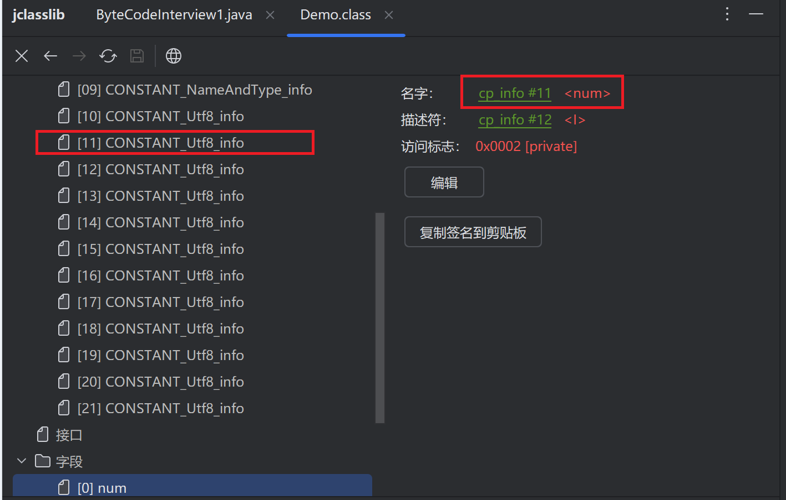

# Class文件结构的分析
使用16进制或者jclasslib打开java class文件

## class文件的结构
- 魔数
- 版本号
- 常量池
- 访问标志
- 类索引、父类索引、接口索引集合
- 字段表集合
- 方法表集合
- 属性表集合

### 魔数
固定值，代表当前文件是一个字节码文件。
CA FE BA BE

### 版本号
前两个字节代表次版本号，后两个字节代表主版本号。  

*向下兼容*，低版本编译的class文件可以被高版本的虚拟机执行。
高版本的虚拟机执行低版本的class文件可能会出现错误。

### 常量池
存放所有常量，是class文件的基石，是class文件的核心。
常量池是一个表，从1开始计数。
查看代码，方法、字段对应的描述，参数，返回值，异常等信息都在常量池中。

#### 符号引用，直接引用
符号引用就是一组符号来描述引用的目标，不一定加载到了虚拟机内存中。
直接引用就是直接指向目标的指针、相对偏移量或一个间接定位到目标的句柄。和虚拟机内存布局相关。

### 访问标识
public

### 类索引 父类索引 接口索引集合

### 字段表集合

### 方法集合
