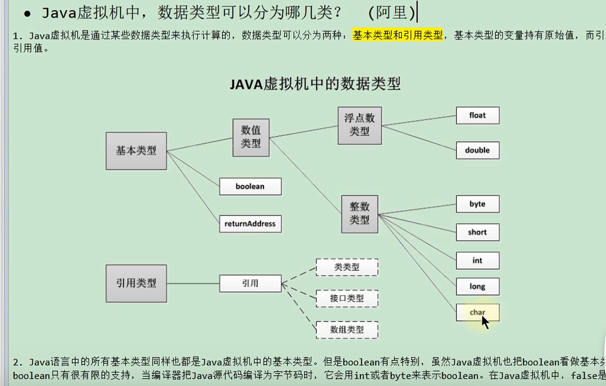

# 相关的字节码指令

## javap
oracl公司提供的java反汇编工具
```bash
javap -v Demo.class
```

## 字节码指令
java虚拟机的指令由一个字节长度的，代表着某种特定操作含义的数字(称为操作码，Opcode)
以及跟随其后的零至多个代表此操作所需的参数(称为操作数，Operand)构成。
操作码加操作数就构成字节码指令。

## 字节码指令的分类
1. 加载和存储指令
2. 运算指令
3. 类型转换指令
4. 对象创建与访问指令
5. 方法调用与返回指令
6. 异常处理指令
7. 同步指令
8. 其他指令

主要关注栈帧的操作指令：
- push
- pop
- load
- store

方法调用指令：
- invokevirtual
- invokespecial
- invokestatic


## java虚拟机种，数据类型可以分为几类？
- 基本类型
- 引用类型



## 为什么不把基本数据类型放在堆种？
栈是线程私有的，生命周期与线程相同，线程结束栈内存也就释放了，不会存在垃圾回收问题。
栈速度快，不需要垃圾回收。
堆，空间大，适合存储。
基本对象的大小是确定的，所以可以在栈上分配。

## java中的参数传递是值传递还是引用传递？
java中只有值传递。
基本类型传递的是值的拷贝，引用类型传递的是引用的拷贝。

## java中有没有指针的概念？
java没有指针的概念。