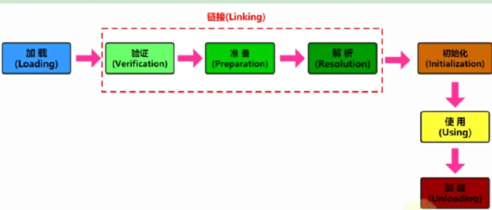

# 类的加载概述_Loading阶段

## 类的生命周期
- 装载
- 链接
- 初始化
- 使用
- 卸载

## Loading装载阶段
将硬盘中的class文件加载到内存中，并生成对应的Class对象。
放在方法区中(jdk1.8之前永久代，jdk1.8之后叫元空间)。

### 二进制流的获取方式
- 从本地系统文件中直接加载
- 通过网络获取，典型场景：Web Applet
- 从zip压缩包中读取，成为日后jar、war格式的基础
- 从数据库中读取，典型场景：中间件服务器
- 运行时计算生成，使用最多的是：动态代理技术

### class实例的位置在哪里
类的数据结构存放在方法区中(元空间)，而对象实例存放在堆中，对象实例(类名)的引用存放在栈中。

### 数组的加载有什么不同
先加载应用类型的类，在JVM运行时根据需要才去创建这个数组。
