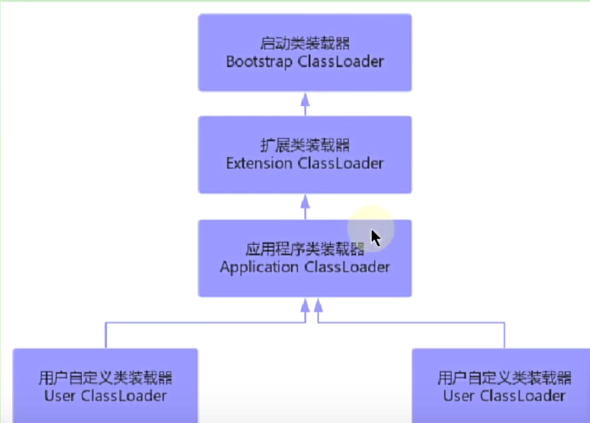

# 类加载器的分类

## 作用范围
类加载器只负责加载类，因此只作用于类的装载(loading)阶段。

## 显示加载、隐式加载
显式加载：
- Class.forName()
- ClassLoader.loadClass()  

隐式加载：
- new对象
- clone、反序列化对象时
- 调用类的静态方法

## 类的唯一性
只有类的加载器和类的全限定名相同，才认为是同一个类。

## 可见性 
子类加载器可以访问父类加载器

## 单一性
字父类加载器加载同一个类，只会加载一次。