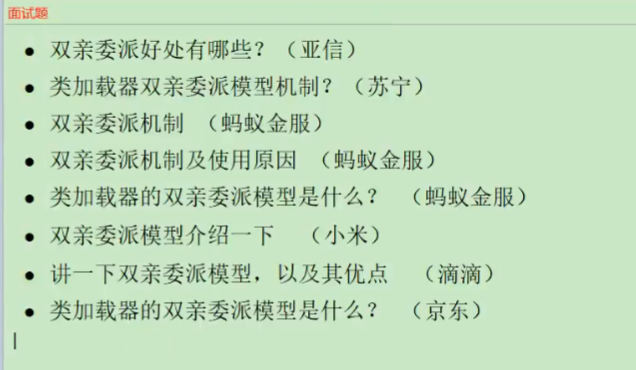

# 双亲委派机制
ClassLoader类的loadClass方法，会去递归调用父类的loadClass方法，  
（向上委托）去加载类，如果父类有就会返回这个类，如果没有就会去调用findClass方法去加载类。

## 面试题

- 好处/优势：避免类的重复加载，保证类的唯一性。对类的保护，防止被篡改。
- 缺点：父类无法访问子类的资源。

## 破坏双亲委派机制：

### 热部署/热替换
在更新类时，用新的类加载器去加载新的类，然后对旧类的加载器不在引用，释放旧的类。

### Tomcat类加载机制
