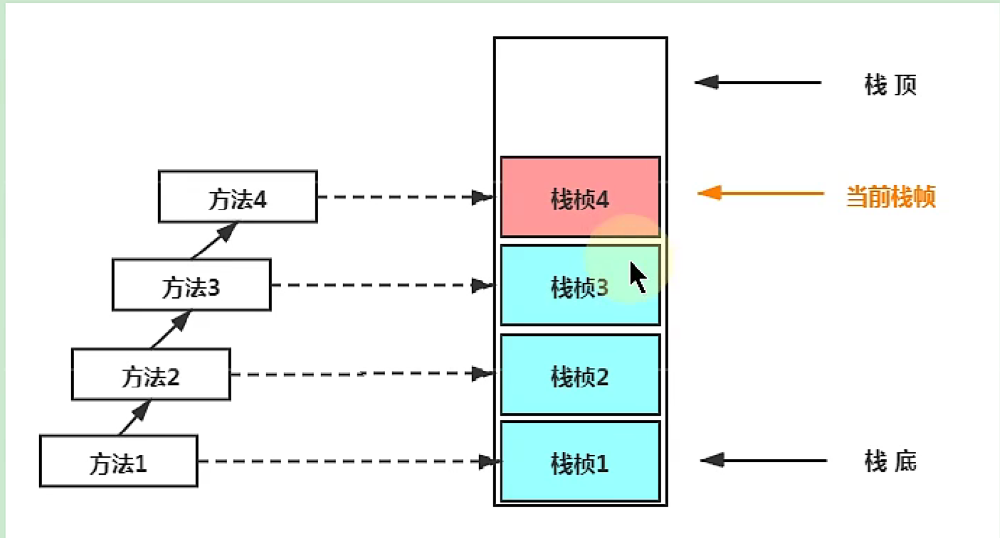
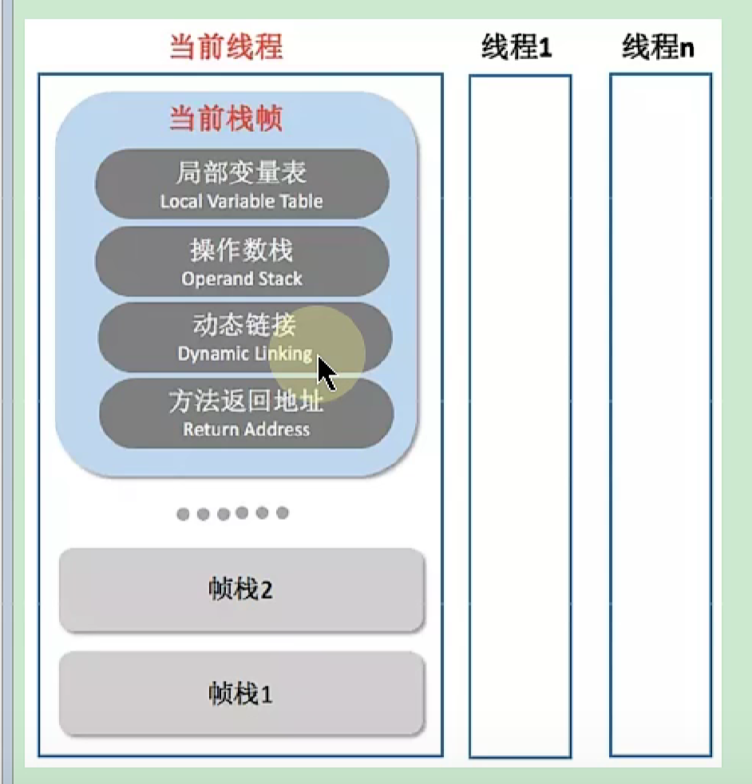
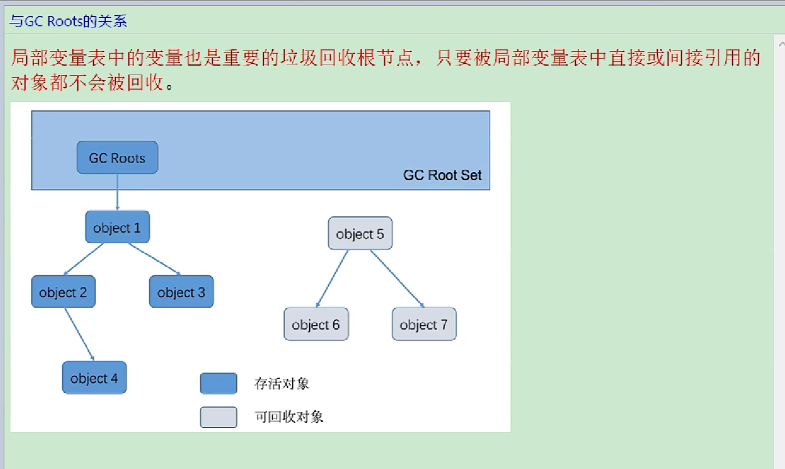

# 局部变量表的说明
- 定义为一个数组，用于存储方法的参数和方法内的局部变量。
- 基础类型直接存储值，引用类型存储引用地址
- 局部变量表中的变量只在当前方法调用中有效。
- this在非静态方法中，存储的是当前对象的引用地址。
- 局部变量需要初始化赋值后才能使用。

## 栈的大小
在java5.0之前是512kb，在java5.0之后是1024kb  
通过-Xss参数设置栈的大小

## 栈帧
线程中的每个方法都会创建一个栈帧

### 栈帧的组成

## GCRoots
局部变量表中的变量都可以作为GCRoots

