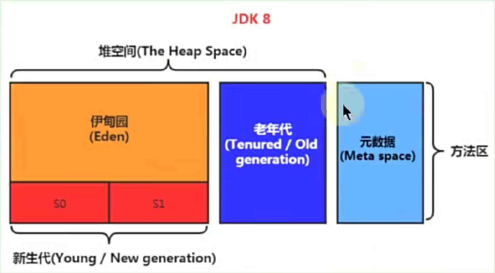

# 堆空间大小

- JVM 实例中只存在一个堆内存，且堆是所有线程共享的内存区域。
- 堆内存的大小在 JVM 启动时即已设定，属于 JVM 管理的最大内存块。
- 堆空间是垃圾回收（GC）的重点区域，方法结束后，堆中的对象不会立即被移除，而是在垃圾收集时才会被清理。

## 堆的分配
几乎所有的对象和数组都在堆上分配内存。
(可能存在栈上分配的优化，具体取决于 JVM 的实现)

### 栈上分配
JVM 会尝试将对象分配到栈上，以减少垃圾回收的频率。
如果这个对象只在方法中使用，生命周期非常短，随着方法的结束而结束，那么 JVM 会将其分配到栈上。

## 堆空间中的TLAB(Thread Local Allocation Buffer)
线程局部分配缓冲区，是堆空间中的一个特殊区域，每个线程都有一个 TLAB。

## 分代收集
在jdk7之前，方法区逻辑上依然属于堆空间的一部分。
在jdk8之后，方法区的内存被移到了元空间。

堆分代，可以分为新生代和老年代。
- 新生代：Eden + Survivor0 + Survivor1
- 老年代：存放生命周期长的对象。

对于一些类的生命周期非常长，我们可以直接放到老年代中。几乎所有的类都是在伊甸园区创建的。  
大对象直接进入老年代。**避免过多的创建大对象**

80%的对象都是在新生代就会被回收。

## 设置堆空间的大小
- -Xms：设置堆空间的初始大小
- -Xmx：设置堆空间的最大大小  

通常将初始大小和最大大小设置为相同的值，
在gc后不需要重新计算堆空间的大小，从而提升性能。

默认值：
- 初始大小：物理内存的1/64
- 最大大小：物理内存的1/4