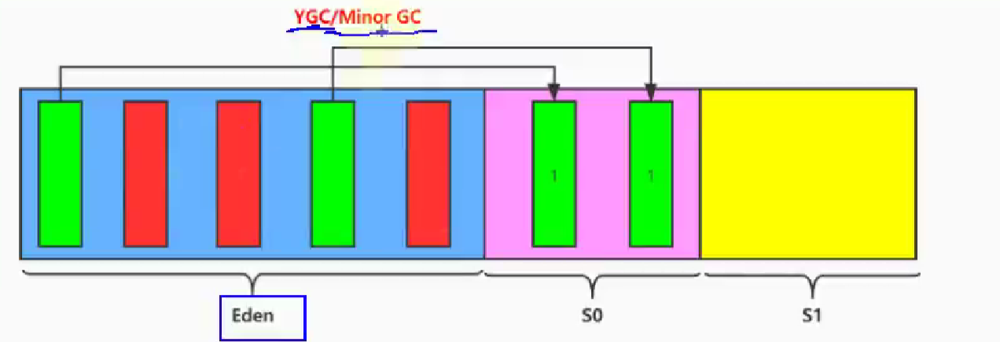
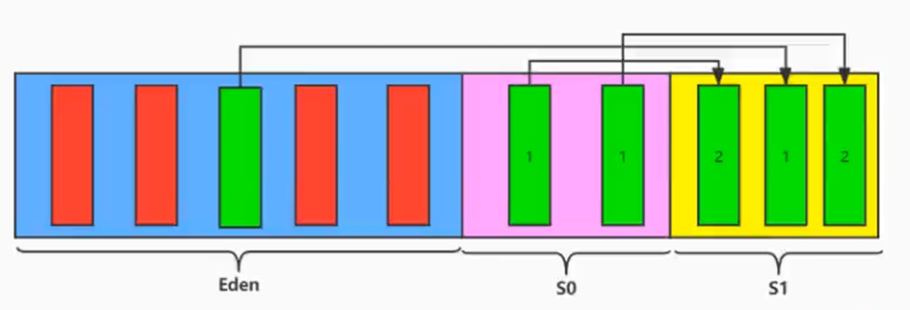
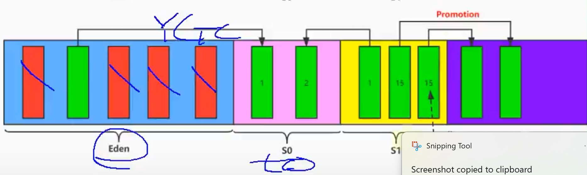
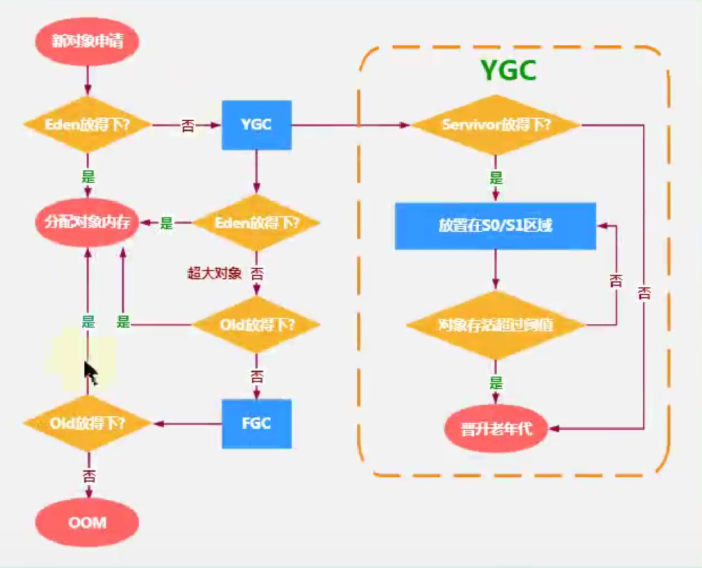

# 对象分配过程
特点：
- 频繁的在新生代收集
- 很少在老年代收集
- 几乎不在永久代/元空间收集

分配过程：
- 优先分配到Eden区
- 大对象直接分配到老年代
- 动态年龄判断：如果s区中年龄相同的对象占到了s区一半以上的空间，那么大于等于该年龄的对象会被分配到老年代
- 1.如果Eden区满了，会触发Yong GC，存活下来的对象会被复制到S0区
- 2.继续运行，如果Eden区满了，会触发Yong GC，存活下来的对象会被复制到S1区
- 3.继续运行，Eden区满了，会触发Yong GC，存活下来的对象会被复制到S0区
- 4.当yongGC次数达到15(4bit大小)次，依旧存活，会被复制到老年代

红色代表被回收，绿色代表存活

## 空间分配担保策略
如果S区存活的对象空间大于老年代可以用连续空间，那么YongGC会存在风险，可能会触发Full GC

