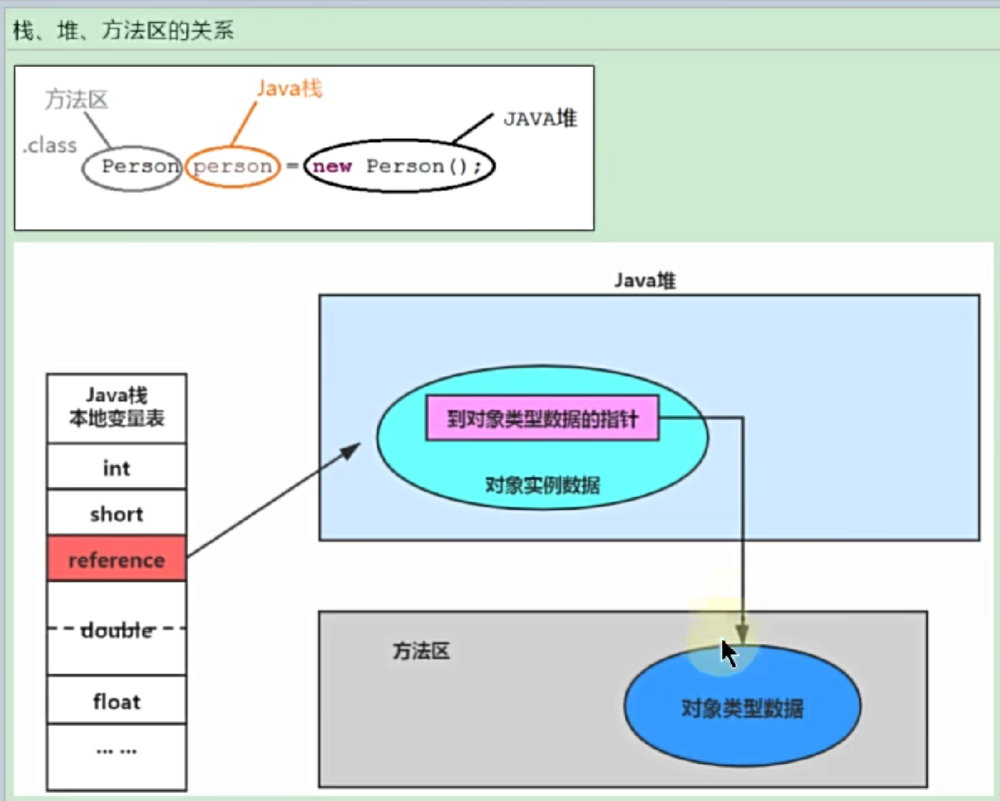
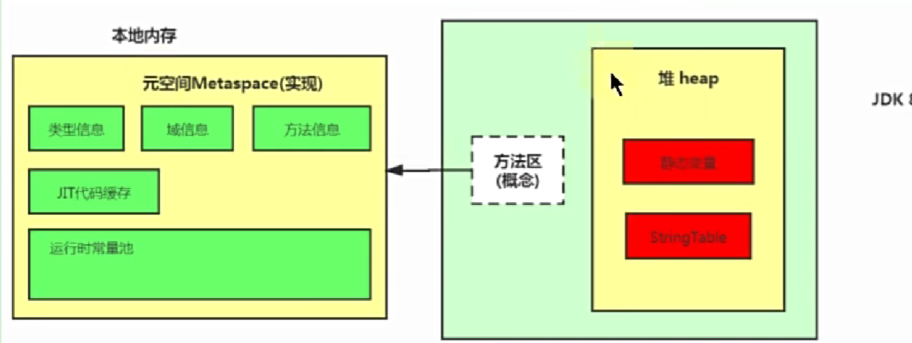

# 方法区
方法区几乎不回收，回收效率也不高。

## 栈堆方法区的关系
栈存放的是基本数据类型和对象的引用，堆存放的是对象本身，方法区存放的是类信息、常量、静态变量、即时编译器编译后的代码等数据。

## 方法区的演进
- JDK8开始元空间取代了永久代。不在使用虚拟机中的内存，而是直接使用本地内存。
- 静态变量和字符串常量池转移到了堆中 (回收效率更高)

### 元空间内存溢出
- 大量加载Jar包
- Tomcat上部署的应用过多
- 大量动态生成反射类
