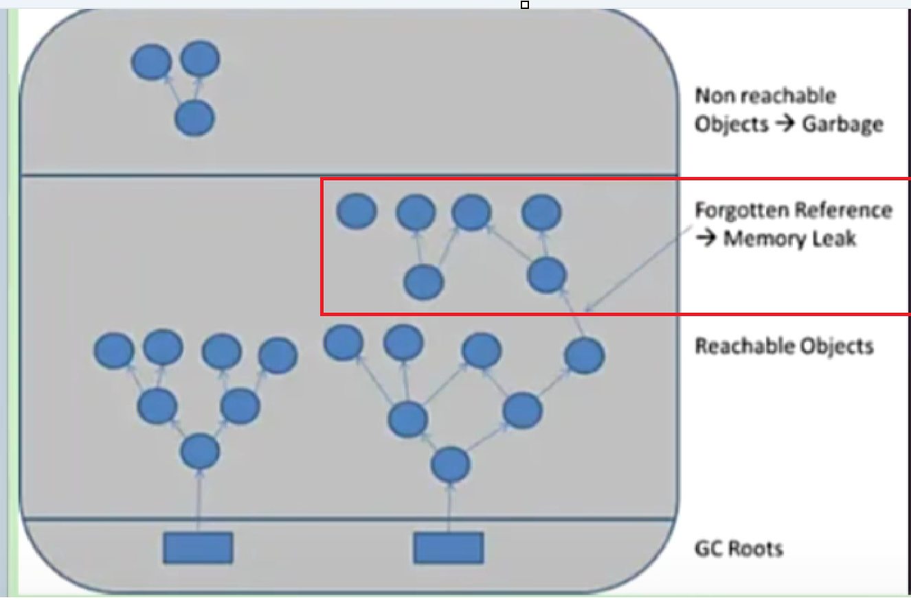

# 可达性分析算法(根搜索算法)
找到根对象，只有被根对象引用的对象才是存活对象。

## 优缺点
- 解决循环引用的问题，有效防止内存泄漏  

依然存在内存泄露问题，即实际没有使用了，但是和根对象依然有引用，无法被gc

## GC Roots
- 在局部变量表中，引用的对象都是GC Roots
- 方法区中的常量
- 类的静态变量
- 锁持的对象
- 异常的对象

## 注意点
在进行根搜索时，需要保证分析工作是在一个一致性快照中进行的，才能保证结果的准确性和一致性。  
这也是为什么需要STW的原因。