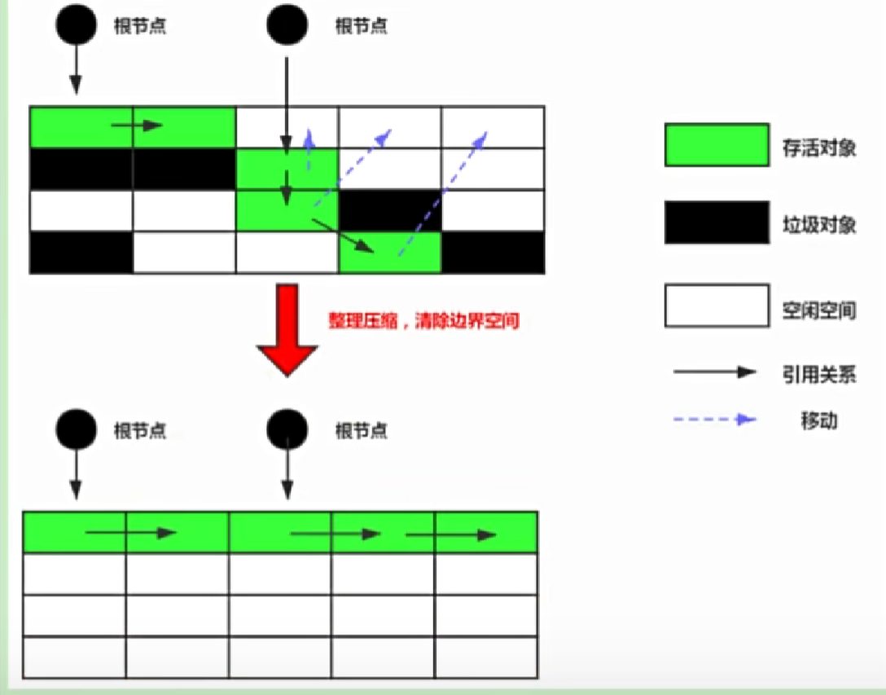

# 垃圾清除阶段-标记清除算法
把不是垃圾的对象标记出来，然后清除掉没有标记的对象。

## 优缺点
- 内存大量的碎片化
- 效率较低，需要递归，便利整个堆空间
- 需要STW，用户体验差

# 复制算法
From区TO区就是复制算法。  

把内存分为两块，每次只使用其中一块，当一块内存使用完后，把不是垃圾的对象复制到另一块内存中，然后清除掉原来的内存。

## 优缺点
- 不存在内存碎片
- 需要更多的内存空间
- 如果对象存活率高，效率较低

# 标记整理算法
老年代gc频率较低，通常使用该算法。  
标记的同时移动存活的对象空间

## 优缺点
- 不需要更多的内存空间
- 解决碎片化的问题
- 效率不高，不仅要标记，还要移动，还要调整指针

## 为什么要使用分代收集？和java有关吗？
和java无关，对于有大量(80%)对象都是朝生夕死，使用新生代，老年代可以有效区分出这些对象，针对使用不同的垃圾清理算法。

# 增量收集算法
垃圾标记，垃圾清除都涉及到stw的问题，影响应用执行效率。  
增量收集允许gc和执行同时进行，即先对一部分内存gc，有一定空间后继续运行，直到垃圾收集完成。  

缺点是会造成吞吐量下降，但是可以低延迟