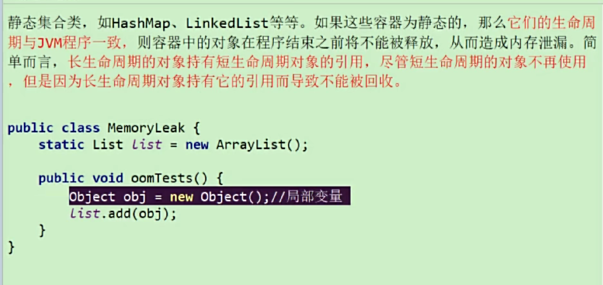

# 内存泄露和内存溢出
- 内存溢出，GC回收的速度，内存不够，内存大量碎片化，大对象存不下了。
- 内存泄露，垃圾无法回收，内存泄漏的堆积最终会导致内存溢出。

## OOM前必有GC？
通常情况下会有，OOM前会尝试GC。超大对象放不下，超出内存上限，会直接OOM。

## 内存泄露的8中情况
### 静态变量集合类
静态集合(长生命周期对象)持有了obj对象，那么obj对象也不会被回收。

### 单例模式
单例的实例也是静态对象。

### 内部类持有外部类

### 各种连接资源
finally{} 手动引用关闭资源。

### 变量作用域不合理

### 缓存泄露
对于缓存对象，没有及时清理，导致内存泄漏。可以使用weakHashMap。  
weakHashMap的key是弱引用，当key没有被引用时，可以被垃圾回收器回收。
