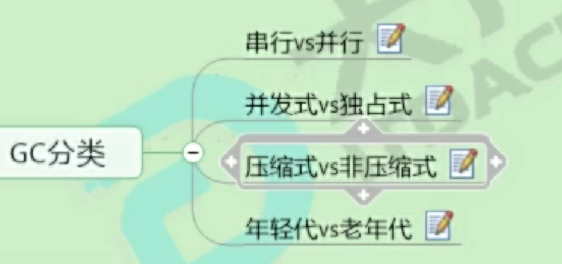

# GC评价指标
- 吞吐量
运行时间/运行时间+GC时间
- 暂停时间
- 内存占用  

现在追求最大吞吐量情况下，降低停顿时间。

不可能三角形：吞吐量、暂停时间、内存占用三者不能同时满足。  
主要追求吞吐量和低延迟两种方案。 

## GC收集器的各种运行方案：
- 串行、并行；是否多线程
- 并发、独占；是否多CPU并发工作
- 压缩式、非压缩式；是否压缩(整理空间)
- 分代、不分代；是否按照对象的生命周期进行划分
