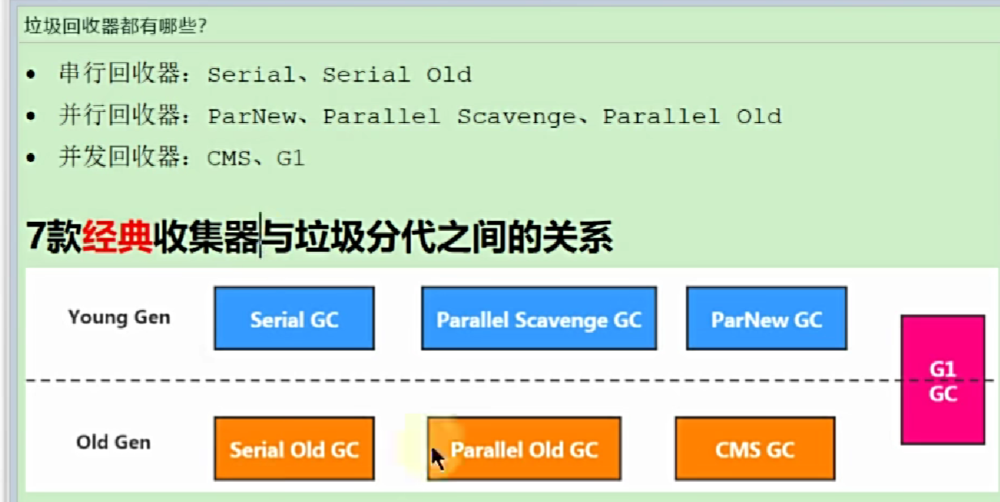
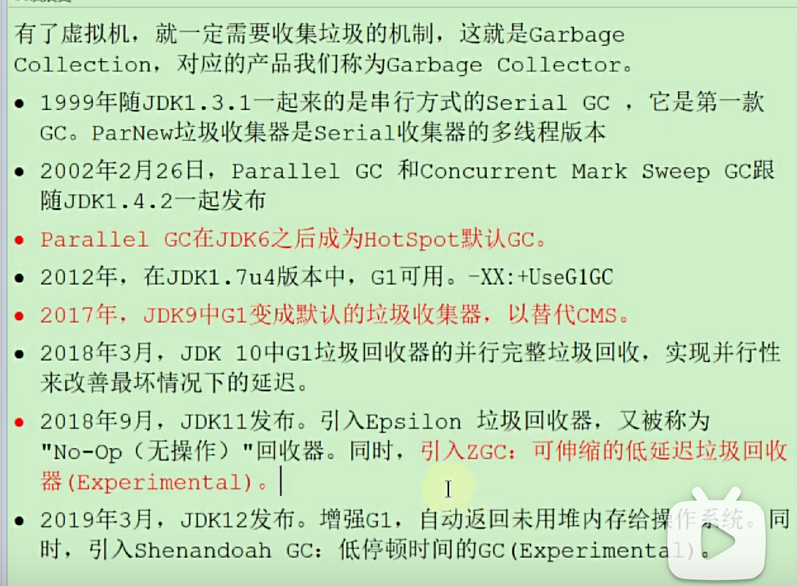
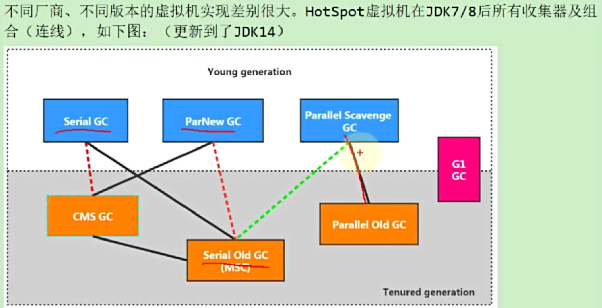

# GC的组合关系
cms和G1都是低延迟的垃圾回收器。

## 垃圾回收器有哪些
- 串行回收期
- 并行回收期
- 并发回收期

## 垃圾回收器的历史
- jdk1.7种引入了G1GC，需要使用jvm命令显示的使用，-XX:+UseG1GC
- jdk1.9中G1GC变为默认的垃圾回收器
- jdk11中引入了ZGC
- jdk12增强了G1GC
- jdk14删除了cms
.....

## GC组合
实线代表可以搭配使用。  
JDK8中默认的垃圾回收器是ParallelGC
