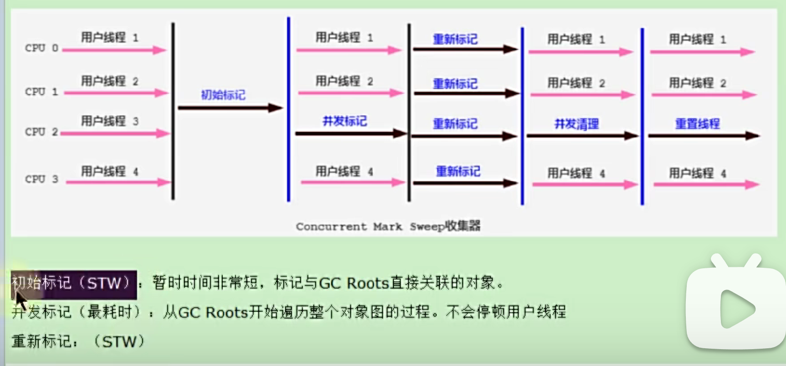

# CMSGC
第一款并发收集器，低延迟，实现了用户线程和垃圾回收线程并发执行。  
作为老年代收集器，使用标记清除算法。

## 工作流程
1. 初始标记
2. 并发标记
3. 重新标记
4. 并发清除

只有初始标记和重新标记会STW。并不是内存满了才触发gc而是达到阈值就触发gc。因为并发清除时，还有用户线程运行，需要预留空间。

CMSGC无法完成时，有备用SerialOld来进行垃圾回收。
