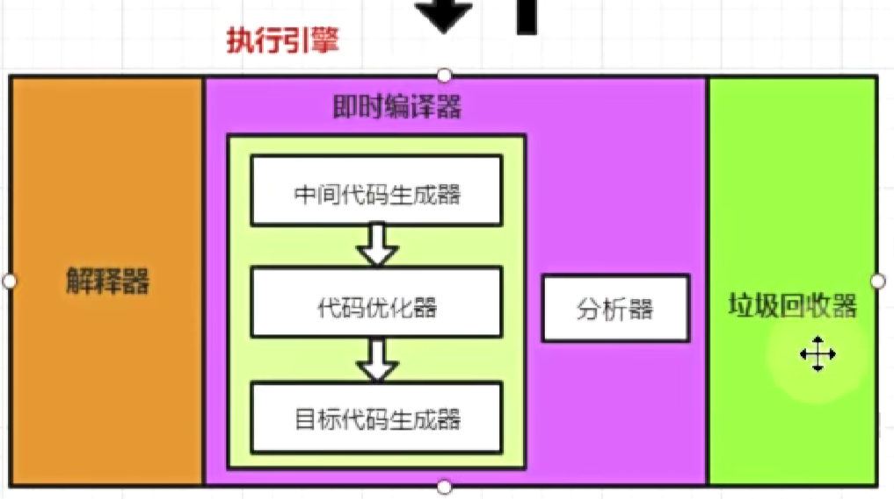
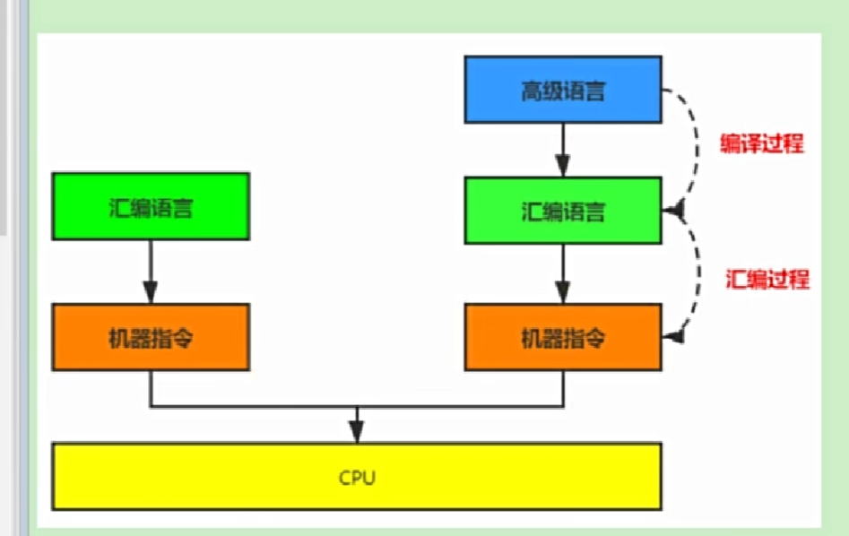
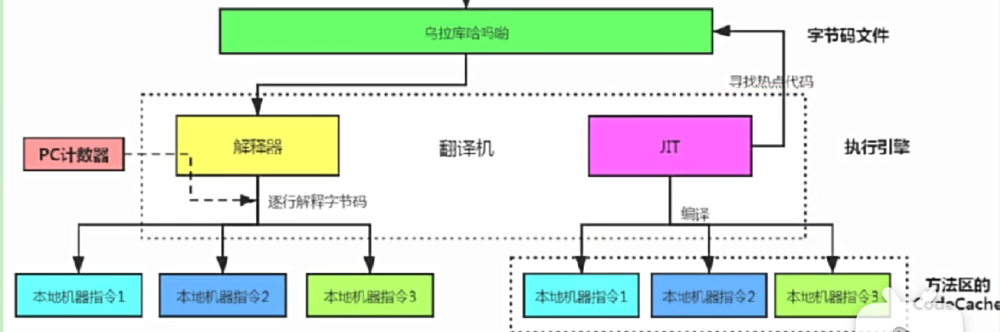

# 解释器与JIT编译器
将字节码指令解释为机器码的过程

## 工作过程
依赖于pc寄存器，通过pc寄存器获取指令，然后执行指令

## JIT编译器
只用解释器，执行效率比较低，因为解释器每次都要执行指令，然后再执行下一条指令
- 对于热点代码，有缓存优化。将热点代码编译为机器码后，添加缓存，每次执行时，直接执行机器码  
而执行引擎只能反复翻译热点代码然后执行，效率比较低。
- JIT在服务启动时，响应没有解释器快，解释器解释一行，运行一行，JIT需要解释文件后，才编译为机器码。

## AOT
AOT是在程序执行前就翻译好了机器码，速度更快，但是破坏了一次编译到处运行的原则。

## C1编译器，C2编译器
- C1编译器是客户端编译器，常用于桌面应用程序，C1启动时间短，运行过程中速度没有C2快
- C2编译器是服务端编译器，常用于服务器应用程序，C2启动时间长，运行更快